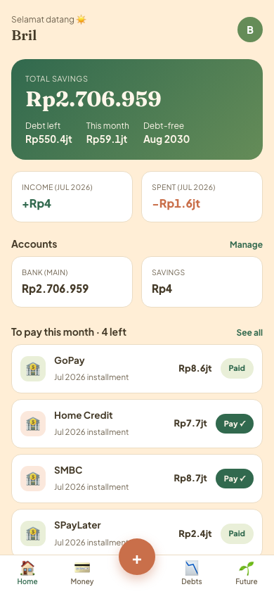
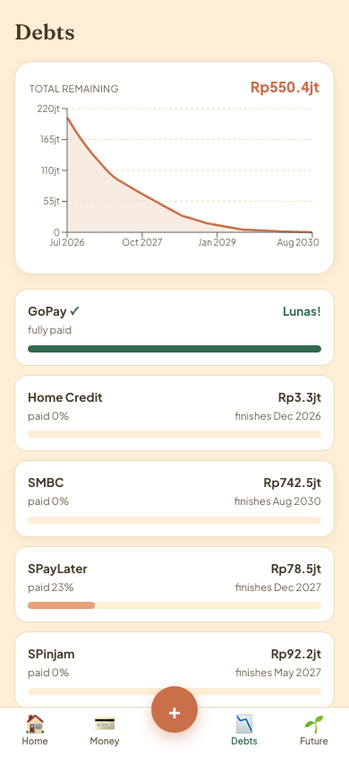
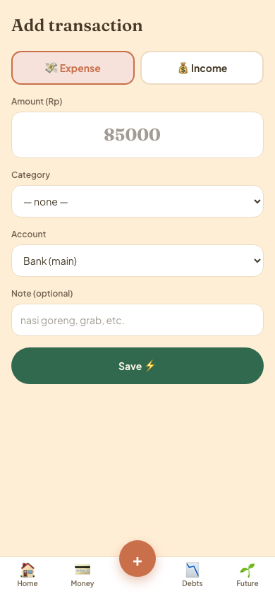
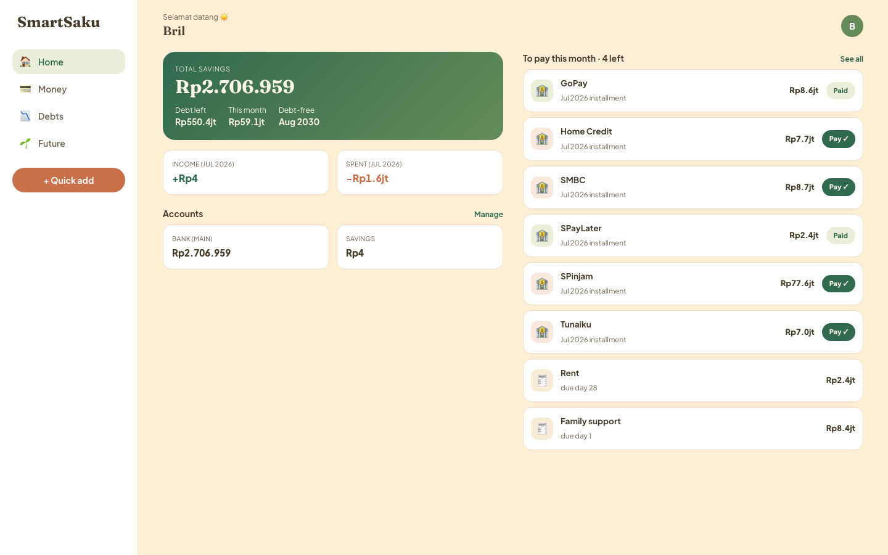
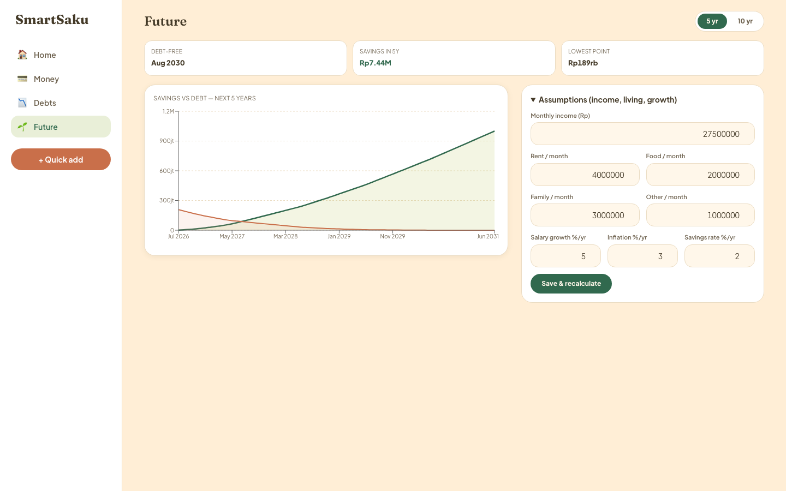

# SmartSaku 🌱

Personal money manager + debt payoff app. Warm, calm, mobile-first. All amounts in IDR.

## Human-friendly overview

SmartSaku tracks your bank accounts, income and expenses, and your loan payoff schedules.
Each month you mark which installments you paid, and the app projects your savings and
debt for the next 5–10 years. Data lives in Postgres (Neon); each user only sees their own data.

---

## Screenshots

*Amounts in the screenshots are randomized sample values.*

### Mobile (default experience)

| Home | Debts | Quick add |
|---|---|---|
|  |  |  |

### Desktop





## Stack

- Next.js 16 (App Router, Turbopack) + TypeScript
- Tailwind CSS v4 (design tokens in `app/globals.css`, full system in `DESIGN.md`)
- Prisma 6 + PostgreSQL (Neon)
- Auth: email + password, JWT cookie sessions (jose + bcryptjs)
- Charts: recharts

## Local development

```bash
npm install
cp .env.example .env   # fill in the values (see below)
npx prisma db push     # create tables
npm run seed           # baseline data + first user
npm run dev
```

## Environment variables

| Name | Required | What it is |
|---|---|---|
| `DATABASE_URL` | yes | Neon Postgres connection string (`postgresql://...?sslmode=require&channel_binding=require`) |
| `AUTH_SECRET` | yes | Long random string that signs session cookies. Generate one: `openssl rand -base64 32` |
| `SEED_USER_PASSWORD` | only for seeding | Password given to the seed user by `npm run seed` |

## Deploy to Vercel

1. Import this repo in Vercel (framework preset: Next.js — detected automatically).
2. Add the environment variables above (`DATABASE_URL`, `AUTH_SECRET`) for Production.
3. Deploy. The database schema must already exist — run `npx prisma db push` and
   `npm run seed` once from your machine (they run against Neon directly).

`postinstall` runs `prisma generate`, so builds work on Vercel without extra config.
